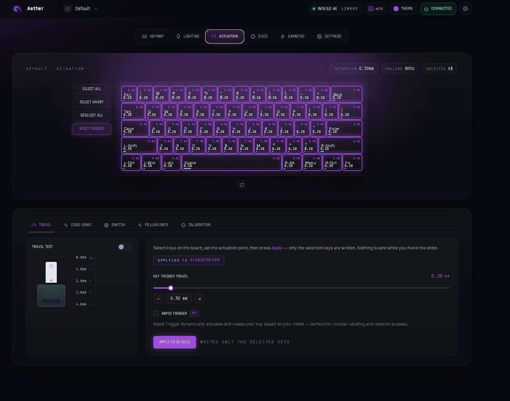

# AETHER HE — Aula WIN60 HE Controller

> ## 📣 We're looking for keyboards to support — submit yours!
> Aether only speaks to the **Aula Win60 HE** today, and we want to change that.
> **Own a different Hall-effect or RGB keyboard? Send us its data and we'll add it.**
> It takes a few minutes, needs **no coding**, and gets your board onto the roadmap
> with its layout drawn in the app.
>
> ### → [**Submit your keyboard**](https://github.com/MrWhosNexus/Aether-HE/issues/new?template=add-a-board.yml) · [How it works](docs/SUBMIT_A_BOARD.md)

Cross-platform desktop controller for the Aula Win60 HE Hall-effect keyboard
(VID `0x2E3C`, PID `0xC365`). React/Tailwind UI rendered natively
(Edge WebView2 on Windows, GTK/WebKit on Linux); HID is bridged to Python.

Features: per-key & multi-color animated lighting (host streaming, 60 fps),
analog actuation + Rapid Trigger, SOCD, key remap, calibration, and an
analog→virtual-gamepad pipeline (Hall-effect travel → Xbox 360 sticks/triggers).



> _Aether HE controlling the Aula Win60 HE. Your board could be next →
> [submit it](https://github.com/MrWhosNexus/Aether-HE/issues/new?template=add-a-board.yml)._

---

## Contributing a keyboard

Aether is built to grow beyond one board. If your keyboard isn't supported yet,
**you can help add it** — most of what we need takes a few minutes and no coding.

### Supported boards

<!-- BOARDS:START -->
| Keyboard | Switches | Lighting | Actuation | Status |
|----------|----------|----------|-----------|--------|
| Aula Win60 HE | Hall-effect | ✅ | ✅ | Fully supported |
| Aula MINI60HE Max | Hall-effect | 🚧 | 🚧 | Bring-up — protocol decoded (#4) |
| Aula Mini 60 HE Pro | Hall-effect | — | — | Layout added — needs captures (#6) |
| Aula Win60 HE Max | Hall-effect | — | — | Layout added — needs captures (#5) |
| Aula win68 HE Max | Hall-effect | — | — | Layout added (65%) — needs captures (#7) |
| Aula WIN 60 HE Pro | Hall-effect | — | — | Layout added — SayoDevice, needs captures (#3) |
| **Your board?** | — | — | — | **[Submit it →](https://github.com/MrWhosNexus/Aether-HE/issues/new?template=add-a-board.yml)** |
<!-- BOARDS:END -->

> This table is generated from [`data/boards.json`](data/boards.json) — it grows
> automatically as new boards are merged (`python tools/gen_boards_table.py --write`).

### What we need from you

Open the **[Add-a-keyboard form](https://github.com/MrWhosNexus/Aether-HE/issues/new?template=add-a-board.yml)**
and fill in what you can. There are two tiers:

**🟢 Required (anyone can do this)** — gets your board on the roadmap with its layout drawn:
- Brand & exact model
- Switch type (Hall-effect / mechanical / optical) and size (60%, 65%, 75%, TKL…)
- USB **VID:PID** — run `python tools/list_hid.py`, or read it from Device Manager / `lsusb`
- The official software/driver you use today (name + link)
- A clear top-down photo (for the layout) and the underside label

**🔵 Advanced (optional, speeds things up a lot)** — for those comfortable in a terminal:
- HID interface dump (`python tools/list_hid.py <VID>`)
- A filled-in `keymap.json` (per-key layout)
- Key-index stride and protocol captures (lighting / actuation)

Every submission is reviewed and validated before it ships — see
[**docs/SUBMIT_A_BOARD.md**](docs/SUBMIT_A_BOARD.md) for the full walkthrough,
copy-paste templates, and how-to-capture instructions.

> Don't want to fiddle with JSON or captures? **Just send the photo and the required
> fields** — the maintainer builds the layout and reverse-engineers the protocol from there.

---

## Install — Windows

**Fastest path — real installer (recommended):**

1. Download **`AetherHE-Setup.exe`** from
   [Releases](https://github.com/MrWhosNexus/aether-linux-app/releases)
   (or grab `dist/AetherHE-Setup.exe` from a local build).
2. Run it. The wizard installs to `Program Files\AetherHE`, creates
   Start Menu + Desktop shortcuts, registers an entry in Add/Remove
   Programs, and (if you check the box) installs the ViGEmBus driver
   for virtual gamepad support.
3. Launch from Start Menu / Desktop. Pair the keyboard from the pill
   in the top-right.

**Or use the portable zip** — `AetherHE-windows.zip`, extract anywhere,
run `AetherHE.exe`. No shortcuts, no uninstaller; just the app folder.

**Settings persistence** — lighting / actuation / SOCD / gamepad mappings
auto-save to `%LocalAppData%\AetherHE\settings.json` and reload on launch.

**Virtual gamepad (optional):** The Gamepad tab needs the ViGEmBus kernel
driver. It's bundled with the build — when you first toggle gamepad capture
and the driver isn't present, the UI shows an **"Install ViGEmBus"** button
that runs the bundled installer (`vendor/ViGEmBus_Setup.exe`) under UAC.

**Build from source:**

```bat
py -3.12 -m venv venv-web
venv-web\Scripts\pip install -r requirements.txt pyinstaller
build_installer.bat
```

Outputs:
- `dist\AetherHE-Setup.exe` (~19 MB, single-file Inno Setup installer)
- `dist\AetherHE\AetherHE.exe` (~45 MB folder, portable)
- `dist\AetherHE-windows.zip` (~23 MB, shareable portable build)

The script downloads the latest ViGEmBus installer into `vendor/` on
first run and skips the Inno step if Inno Setup 6 isn't installed.
`winget install JRSoftware.InnoSetup` covers that one-time prereq.

To launch from source without building: `run.bat`.

---

## Install — Linux

**Fastest path — Flatpak (recommended):**

```sh
# One-time: install the runtime + the app bundle
flatpak install --user flathub org.gnome.Platform//49      # if not present
flatpak install --user AetherHE.flatpak                    # from Releases
flatpak run io.github.mrwhosnexus.AetherHE
```

Still install the udev rules on the host (step 3 below) — the sandbox is
granted device access but the host rules govern the node permissions.

**Build the Flatpak from source** (needs `org.gnome.Sdk//49` and
`org.flatpak.Builder`, both from Flathub):

```sh
flatpak run org.flatpak.Builder --force-clean --user --install \
  --repo=flatpak/repo flatpak/build-dir \
  flatpak/io.github.mrwhosnexus.AetherHE.yml
# Shareable single-file bundle:
flatpak build-bundle flatpak/repo flatpak/AetherHE.flatpak io.github.mrwhosnexus.AetherHE
```

**From source (no Flatpak)** — tested on CachyOS / Arch; works on any distro
with GTK 3, WebKit2GTK, and Python 3.10+.

```sh
# 1. System deps (Arch / CachyOS — adjust for your distro)
sudo pacman -S python python-gobject webkit2gtk libusb

# 2. App venv (needs --system-site-packages so GTK introspection bindings
#    resolve at runtime; pywebview uses them for the WebKit window).
python -m venv --system-site-packages venv-web
venv-web/bin/pip install -r requirements.txt

# 3. udev: device access + uinput (gamepad) without sudo.
sudo cp 99-aula.rules 99-uinput.rules /etc/udev/rules.d/
sudo udevadm control --reload-rules && sudo udevadm trigger
sudo usermod -aG input "$USER"       # for /dev/uinput
#    Log out / back in, OR run:  newgrp input

# 4. Run.
./run.sh
```

`requirements.txt` is cross-platform — `evdev` is auto-installed only on
Linux, `vgamepad` only on Windows. ViGEmBus is not used on Linux.

---

## Updates

The app self-updates from **GitHub Releases** — one publish reaches every OS.
**Settings → Updates** shows the current version, checks for a newer release on
open, and installs it in place:

- **Windows** — downloads `AetherHE-Setup.exe` and runs it silently; the
  installer closes the app, upgrades, and relaunches.
- **Linux (Flatpak)** — downloads `AetherHE.flatpak` and installs it on the
  host via `flatpak-spawn --host flatpak install`; restart the app to apply.
  (GNOME Software / Discover won't auto-update a sideloaded bundle — use the
  in-app button, or re-run `flatpak install AetherHE.flatpak`.)
- **Other** (source checkout) — just reports the available version.

### Cutting a release (maintainer)

From **either** Windows or Linux:

```sh
# 1. bump the version (single source of truth)
#    edit version.py  ->  __version__ = "0.2.0"
# 2. tag and push
git tag v0.2.0 && git push origin v0.2.0
```

`.github/workflows/release.yml` then builds the Windows installer
(`windows-latest`) and the Linux Flatpak bundle (`ubuntu-latest`) and publishes
both as assets on the `v0.2.0` release with auto-generated notes. Users pick it
up on their next check. Keep `installer.iss` (`MyAppVersion`) and the Flatpak
metainfo `<release>` in step with `version.py` when you bump.

---

## Architecture

- **`app_web.py`** — pywebview shell + `Api` HID bridge exposed to JS as
  `window.pywebview.api`. Handles connect, lighting, per-key streaming,
  actuation, SOCD, remap, calibration, gamepad capture.
- **`protocol.py`** — HID packet builders (cmd 7 lighting, cmd 9 per-key,
  cmd 33 actuation/travel-test/calibration), reverse-engineered from the
  official WebHID driver.
- **`aula_device.py`** — thread-safe hidapi wrapper.
- **`device_state.py`** — `KeyMap` (key index ↔ design code ↔ xy),
  `LiveReader` (travel stream), `CalibrationReader`.
- **`effects.py`** — host-driven per-key effect engine. Streams 60 fps
  cmd-9 RGB pages to the board for multi-color effects (firmware modes
  only hold one fg + one bg).
- **`gamepad.py`** — analog key travel → virtual gamepad. Picks backend at
  runtime: `evdev`/uinput on Linux, `vgamepad`/ViGEmBus on Windows.
- **`ui/runtime_src/`** — React/Tailwind source; precompiled offline by
  `build_runtime.py` into `ui/index_runtime.html` (no Node at runtime).

## HID protocol cheat-sheet (verified on hardware)

- **Lighting (cmd 7)** — `[5]=mode, [6]=bri (1-4), [7]=speed (1-4),
  [8:10]=fg, [11:13]=bg, [14]=dir, [15]=fullColor, [16]=power`.
  Mode bytes: static 0, breath 1, wave 2, neon 3, radar 4, reactive 6,
  cross 7, ripple 8, twinkle 9, custom 10, fireworks 11, speedres 12,
  autorip 14, striation 15, aurora 16. Direction bytes: right 0, left 1,
  up 2, down 3, spread 4, gather 5.
- **Per-key RGB (cmd 9)** — 396-byte table sent in 54-byte pages, host
  engine streams at 60 fps.
- **Actuation (cmd 33)** — travel/RT. Trigger MODE: 0 = fixed actuation,
  12 = rapid-trigger single, 13 = RT separate press/release. Units of
  0.01 mm; range 0.08–3.4 mm. Travel-test stream: cmd 33 sub 5,
  `idx = r[7]*22 + r[8]`, `depth = (r[9] | r[10]<<8) / 100`.
- **Calibration** — cmd 33 sub `r[6] ∈ {8, 15}`; bitmask in `r[8:30]`
  marks which keys are calibrated.

## Status

| Feature | State |
|---|---|
| Lighting (static + animated, multi-color) | ✅ |
| Actuation & Rapid Trigger | ✅ |
| SOCD | ✅ |
| Key remap (Remap Key tab) | ✅ |
| Calibration | ✅ |
| Analog → virtual gamepad | ✅ Linux (uinput) / Windows (ViGEmBus) |
| Profiles | ⬜ in-memory only — persistence pending |
| DKS / MT / TGL (Advanced Keymap) | ⬜ UI present, HID wiring pending |
